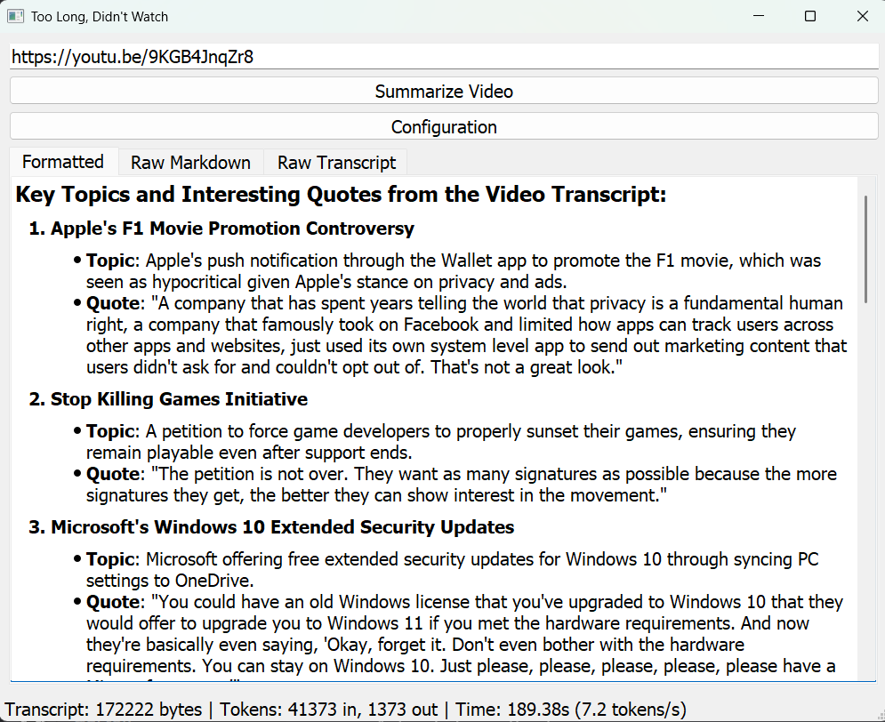

# TLDW

I don't have time to watch all this Youtube content.  TLDW will accept a youtube URL, download the transcript for the video, and summarize it with an LLM.



## Installation

```
pip install -r requirements.txt
```

## Configuration

Copy sample.env to .env and point your endpoint URLs to any openai compatible api.  Ideally used with llama.cpp or ollama for local summarization.

## Running

Run either tldw.bat or tldw.sh to start app.

## Usage

Paste in a youtube url and hit summarize video